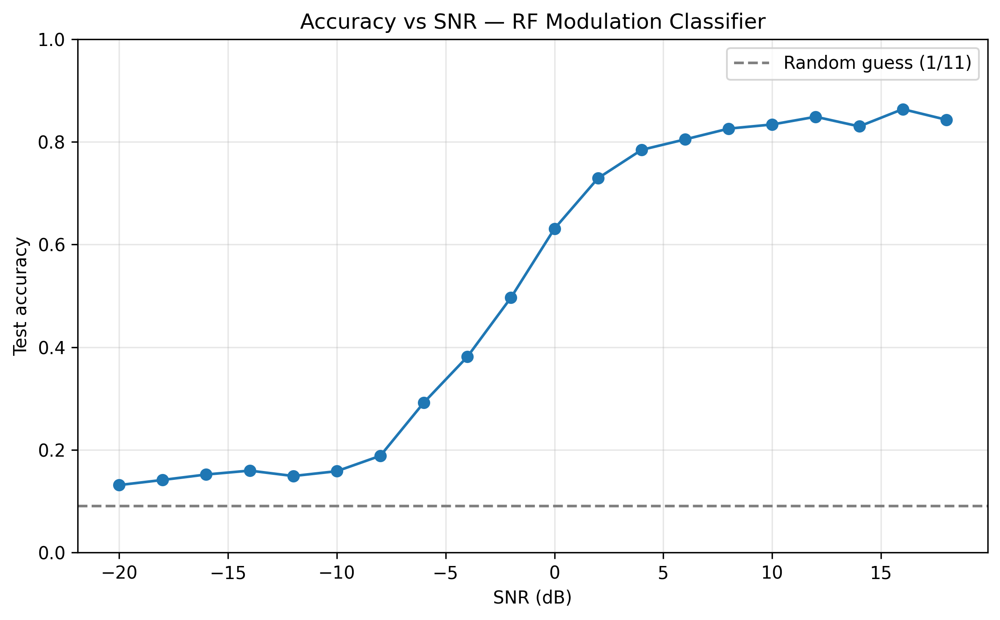
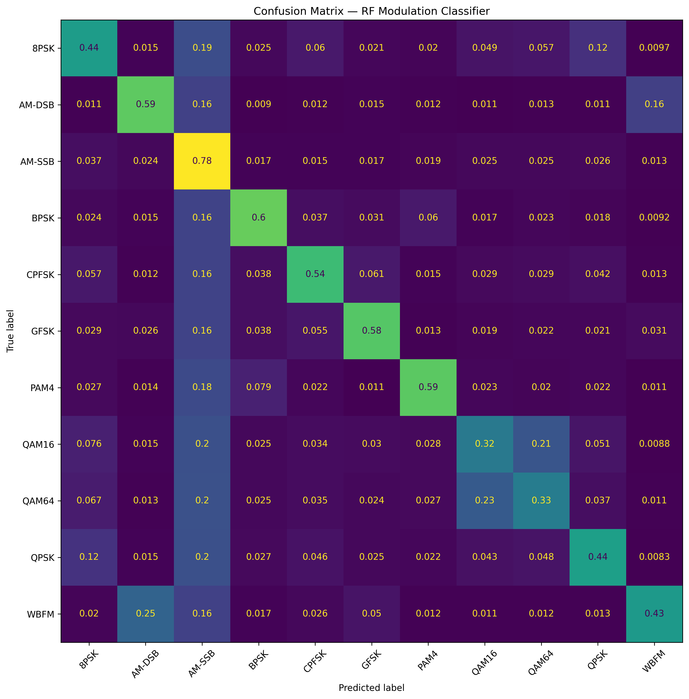
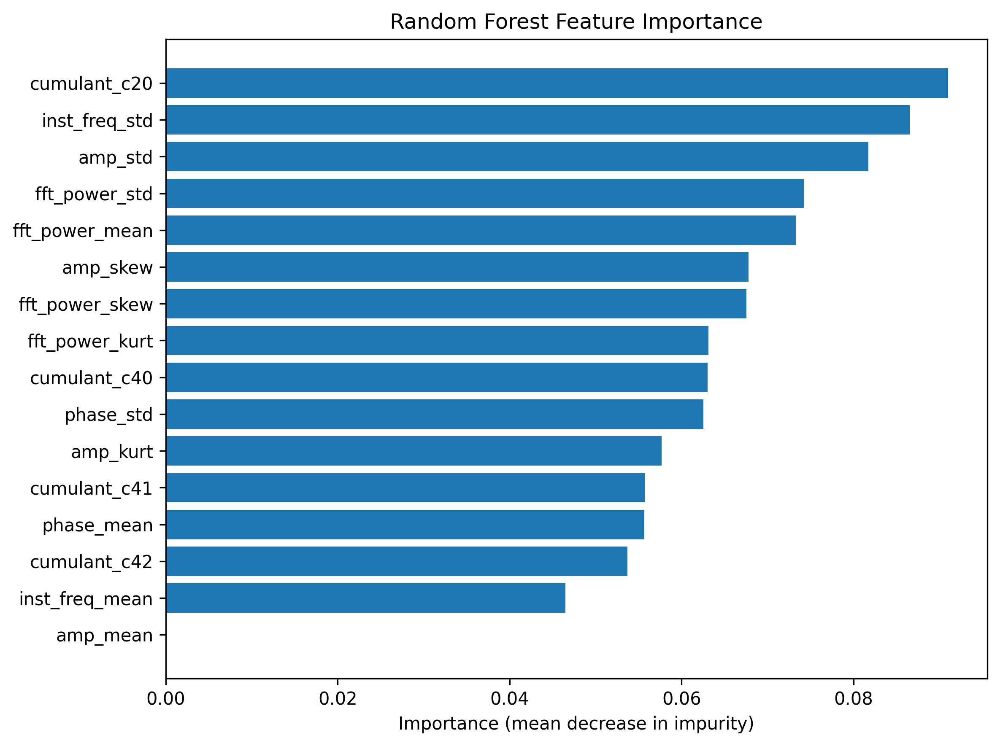

# RF Modulation Classifier

Classifying the modulation scheme of a radio signal from its raw I/Q samples,
using hand-crafted statistical features and a Random Forest. Built on the
**RML2016.10a** benchmark (11 modulation types, 20 SNR levels, 220k samples).

The central question: **how does classification accuracy degrade as the signal
gets noisier?** The accuracy-vs-SNR sweep below answers it.

## Problem

A receiver picks up an I/Q waveform but does not know how it was modulated
(BPSK? QAM16? GFSK?). Automatic Modulation Classification (AMC) recovers that
label — a building block for cognitive radio, spectrum monitoring, and signal
intelligence. Here we test how far classical, interpretable features get us
versus the noise floor.

## Dataset

[RML2016.10a](https://www.deepsig.ai/datasets) (DeepSig). Each sample is a
`(2, 128)` array — 128 complex samples split into in-phase (I) and quadrature
(Q) rows.

| | |
|---|---|
| Modulations (11) | 8PSK, AM-DSB, AM-SSB, BPSK, CPFSK, GFSK, PAM4, QAM16, QAM64, QPSK, WBFM |
| SNR levels (20) | −20 dB … +18 dB in 2 dB steps |
| Samples | 220,000 (1,000 per modulation × SNR pair) |

The dataset is not committed (see `.gitignore`). Download
[RML2016.10a on Kaggle](https://www.kaggle.com/datasets/gustavopolicarpo/rml201610a-dict?resource=download)
and drop the file at `data/RML2016.10a_dict.dat`.

## Method

1. **Feature extraction** ([`src/features.py`](src/features.py)) — each
   `(2, 128)` window is reduced to **16 statistical features** spanning five
   views of the signal:
   - **Amplitude** `√(I²+Q²)`: mean, std, skew, kurtosis
   - **Phase** (unwrapped `atan2`): mean, std
   - **Instantaneous frequency** (derivative of phase): mean, std
   - **FFT power spectrum**: mean, std, skew, kurtosis
   - **Higher-order cumulants** (`|C20|`, `|C40|`, `|C41|`, `|C42|`) of the
     unit-power complex signal — the classical discriminators for separating
     dense constellations (QAM/PSK families).
2. **Classifier** ([`src/model.py`](src/model.py)) — `RandomForestClassifier`
   (100 trees), stratified 80/20 train/test split. The per-sample SNR is
   carried through the split so accuracy can be measured at each SNR level.
3. **Evaluation** ([`src/visualise.py`](src/visualise.py)) — confusion matrix,
   accuracy-vs-SNR sweep, and feature-importance ranking.

## Results

On a held-out 20% test set (44,000 samples), random guess = 1/11 ≈ 9%:

| Metric | Accuracy |
|---|---|
| Pooled (all SNRs) | **51.3%** |
| High-SNR (≥ +6 dB) | **83.6%** |

The pooled number is dragged down by deep-noise samples that are physically
near-unclassifiable; the high-SNR figure reflects the regime where the signal
is actually present. Adding the higher-order cumulants lifted pooled accuracy
from 47.7% → 51.3%, with the biggest gains on the PSK family (BPSK F1
0.50 → 0.63, QPSK 0.40 → 0.49).

### Accuracy vs SNR



| SNR | −20 dB | −10 dB | −4 dB | 0 dB | +6 dB | +12 dB | +16 dB |
|---|---|---|---|---|---|---|---|
| Accuracy | 0.13 | 0.16 | 0.38 | 0.63 | 0.81 | 0.85 | **0.86** |

Accuracy sits near chance (~13%) below −10 dB where the signal is buried in
noise, climbs steeply from −4 dB through 0 dB, and plateaus around **83–86%**
above +6 dB — the expected shape for feature-based AMC.

### Confusion Matrix



Most error mass falls between modulations that look alike in these features —
QAM16 vs QAM64 (dense constellations stay hard at 128-sample windows) and the
analog AM/WBFM group.

### Feature Importance



The added cumulant `|C20|` is the single most important feature, ahead of the
instantaneous-frequency and amplitude spread — confirming the cumulants earn
their place rather than just padding the vector.

> Classical features cap out well below deep-learning AMC (CNNs on this set
> reach ~60% overall). The point here is an interpretable, fast baseline and a
> clean SNR characterisation — not state of the art.

## Project layout

```
src/
  features.py    extract_features(sample) -> 16-dim vector (incl. cumulants)
  dataset.py     load + cache feature matrix (keeps per-sample SNR)
  model.py       split, Random Forest, accuracy_vs_snr + high_snr_accuracy
  visualise.py   plot_iq, confusion matrix, accuracy-vs-SNR, feature importance
  pipeline.py    end-to-end runner
notebooks/
  01_eda.ipynb   exploratory analysis narrative
outputs/
  confusion_matrix.png
  accuracy_vs_snr.png
  feature_importance.png
```

## Run

```bash
# 1. install deps
uv sync

# 2. place RML2016.10a_dict.dat in data/

# 3. run the full pipeline (features are cached to data/features.npz
#    after the first ~15 min extraction)
uv run python src/pipeline.py
```

Writes the confusion matrix, accuracy-vs-SNR curve, and feature-importance
plot to `outputs/`, and prints the per-class report, pooled/high-SNR accuracy,
and per-SNR accuracy table.
